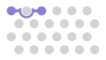
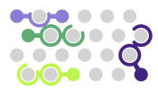
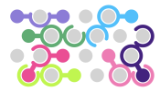
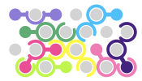
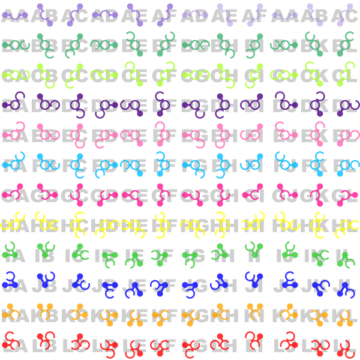

# COMP1110 Assignment 2

*This assignment is only for those enrolled in COMP1110, COMP1510, or COMP6710. COMP1140 students should look [here](https://gitlab.cecs.anu.edu.au/comp1110/comp1140-ass2).*

## Academic Honesty and Integrity

Honesty and integrity are of utmost importance. These goals are *not* at odds with being resourceful and working collaboratively. You *should* be resourceful, you should collaborate within your team, and you should discuss the assignment and other aspects of the course with others taking the class. However, *you must never misrepresent the work of others as your own*. If you have taken ideas from elsewhere or used code sourced from elsewhere, you must say so with *utmost clarity*. At each stage of the assignment you will be asked to submit a statement of originality, either as a group or as individuals. This statement is the place for you to declare which ideas or code contained in your submission were sourced from elsewhere.

Please read the ANU's [official position](http://academichonesty.anu.edu.au/) on academic honesty. If you have any questions, please ask me.

Carefully review the [statement of originality](originality.md) which you must complete.  Edit that statement and update it as you complete each state of the assignment, ensuring that when you complete each stage, a truthful statement is committed and pushed to your repo.

## Purpose

In this assignment you will exercise a number of major themes of the course, including software design and implemention, using development tools such as Git and IntelliJ, using JavaFX to build a user interface.   Above all, this assignment will emphasize group work.

## Assignment Deliverables

The assignment is worth 25% of your total assessment, and it will be marked out of 25. So each mark in the assignment corresponds to a mark in your final assessment for the course. Note that for some stages of the assignment you will get a _group_ mark, and for others you will be _individually_ marked. The mark breakdown and the due dates are described on the [deliverables](http://cs.anu.edu.au/courses/COMP1110/deliverables.html) page.

Your work will be marked via your tutor accessing git, so it is essential that you carefully follow instructions for setting up and maintaining your group repository. At each deadline you will be marked according to whatever is committed to your repository at the time of the deadline. You will be assessed on how effectively you use git as a development tool.

## Problem Description

The assignment involves implementing in Java an board game called [IQ-link](http://www.smartgames.eu/en/smartgames/iq-link)
made by the Dutch games developer [SmartGames](http://www.smartgames.eu/en).

#### Objective 

The game is a puzzle; the objective is to place all twelve colored playing pieces
onto a board comprising 24 pegs which are arranged hexagonally.  The placement must
ensure that all of the pieces fit together correctly.

A completed game:

The following sequence shows the progression of a solution to the game above.

#### Pieces

The game comprises **12 playing pieces**, each of which consists of three **units**.
The center unit is defined to be the **origin** of the piece (the placement of
the piece is defined in terms of the placement of the center unit).  A unit may
either be a **ball**, or a **ring**.  Each ball has one or two 
**connections** extending from it.  Each ring has zero, one, or two **openings**.
A ball and a ring may be placed on the same peg so long as the ball's *connection*
fits exactly in one of the ring's *openings*.

For example, the illustration below shows three of the pieces from the completed
game above.  The ball at the left end of the green piece has a *connection* to
the right, and that connection fits exactly through the *opening* in the ring
at the top of the blue piece.  Likewise, the *opening* in the pink piece is in
exactly the right place to accommodate the *connection* from the blue piece.

Each piece can be **flipped** and **rotated** at 60 degree increments, allowing
for 12 different **orientations** (six rotations and a flip).  The following 
illustration shows all 144 possible combinations of the 12 pieces and 12 orientations.
Note that the first piece exhibits rotational symmetry, so 6 of its rotations
are isomorphic (shown as faint), yielding a total of **138 distinct piece 
orientations** (144 - 6 isomorphisms).

Notice that the center unit of piece A is an example a ring with two openings, 
and the center unit of piece I is an example of a ball with two connections.  The
center unit of piece B is an example of a ring with no openings.

#### Encoding Game State

Game states are encoded as strings.  Your game will need to be able to initialize
itself using these strings and some of your tasks relate directly to these strings.
For example, the game described above is characterized (when complete) by the 
string `BAAHBATCJRDKWEBEFDNGLPHEDIFMJJQKIKLJ`.

##### Placement Strings

A placement string consists of 
between one and twelve (inclusive) **piece placements**. The placement string
may not include any piece twice.

##### Piece Placement Strings

A piece placement string consists of three characters describing the location 
and orientation of a particular piece on the board:

* The first character identifies which peg the origin of the piece is to be placed on ('A' to 'X').
* The second character identifies which of the tweleve pieces is being placed ('A' to 'L').
* The third character identifies which orientation the piece is in ('A' to 'L', except for piece 'A', which has only 'A' to 'F').

The image above shows the second and third characters for each of the pieces in
each of their orientations.   For example, at top left, 'AA' desribes piece 'A'
at orientation 'A'.  Below it, 'BA' describes piece 'B' at orientation 'A'.  At
the bottom right 'LL' describes piece 'L' at orientation 'L'.  And so on.

The progression of twelve images above shows the progression of the game `BAAHBATCJRDKWEBEFDNGLPHEDIFMJJQKIKLJ`,
starting with `BAA`, then showing `BAAHBA`, etc.

##### Legal Piece Placements

Pieces must be placed so that they are strictly non-overlapping.   This means
that a ball can only go in a ring if a) there is not already a ball there, and
b) that there's an opening in the ring at exactly the right place.  A ball cannot
be placed on a ball, and a ring cannot be placed on a ring.

## Legal and Ethical Issues

First, as with any work you do, you must abide by the principles of [honesty and integrity](http://academichonesty.anu.edu.au). I expect you to demonstrate honesty and integrity in everything you do.

In addition to those ground rules, you are to follow the rules one would normaly be subject to in a commercial setting. In particular, you may make use of the works of others under two fundamental conditions: a) your use of their work must be clearly acknowledged, and b) your use of their work must be legal (for example, consistent with any copyright and licensing that applies to the given material). *Please understand that violation of these rules is a very serious offence.*  However, as long as you abide by these rules, you are explicitly invited to conduct research and make use of a variety of sources. You are also given an explicit means with which to declare your use of other sources (via originality statements you must complete). It is important to realize that you will be assessed on the basis of your original contributions to the project. While you won't be penalized for correctly attributed use of others' ideas, the work of others will not be considered as part of your contribution. Therefore, these rules allow you to copy another student's work entirely if: a) they gave you permission to do so, and b) you acknowledged that you had done so. Notice, however, that if you were to do this you would have no original contribution and so would recieve no marks for the assigment (but you would not have broken any rules either).

## Evaluation Criteria

It is essential that you refer to the [deliverables page](http://cs.anu.edu.au/courses/COMP1110/deliverables.html) to check that you understand each of the deadlines and what is required.   Your assignment will be marked via git, so all submittable materials will need to be in git and in the *correct* locations, as prescribed by the [deliverables page](http://cs.anu.edu.au/courses/COMP1110/deliverables.html).

**The mark breakdown is described on the
[deliverables](https://gitlab.cecs.anu.edu.au/comp1110/comp1110/wikis/deliverables) page.**

### Part One

In the first part of the assignment you will:
* Create a UML model of your *initial* design for the final assignment (Task #2).
* Implement parts of the text interface to the game (Tasks #3, and #4).
* Implement a simple viewer that allows you to visualise game states (Task #5).

The criteria for the [completion of part one](https://gitlab.cecs.anu.edu.au/comp1110/comp1110/wikis/deliverables#d2c-assignment-2-stage-c-2-marks-group) is as follows:

**Pass**
* Tasks #2, #3 and #4

**Credit**
* Task #5 *(in addition to all tasks required for Pass)*

**Distinction**
* Task #6 *(in addition to all tasks required for Credit)*

### Part Two

Create a fully working game, using JavaFX to implement a playable graphical version
of the game in a 933x700 window.

Notice that aside from the window size, the details of exactly how the game
looks etc, are **intentionally** left up to you.  The diagrams above are for
illustration purposes only.   However, you are provided with images for each
of the twelve pieces which you may use.

The only **firm** requirements are that:

* you use Java and JavaFX,
* the game respects the specification of the game given here,
* the game be easy to play,
* it runs in a 933x700 window, and
* that it is executable on a standard lab machine from a jar file called `game.jar`,

Your game must successfully run from `game.jar` from within another user's (i.e.
your tutor's) account on a standard lab machine (in other words, your game must
not depend on features not self-contained within that jar file and the Java 8 
runtime).

**Pass**
* Correctly implements all of the <b>Part One</b> criteria.
* Appropriate use of git (as demonstrated by the history of your repo).
* Completion of Task #7
* Executable on a standard lab computer from a runnable jar file, game.jar, which resides in the root level of your group repo.

**Credit**
* _All of the Pass-level criteria, plus the following..._
* Task #8

**Distinction**
* _All of the Credit-level criteria, plus the following..._
* Tasks #9 and #10

**High Distinction**
* _All of the Distinction-level criteria, plus the following..._
* Tasks #11 and #12
